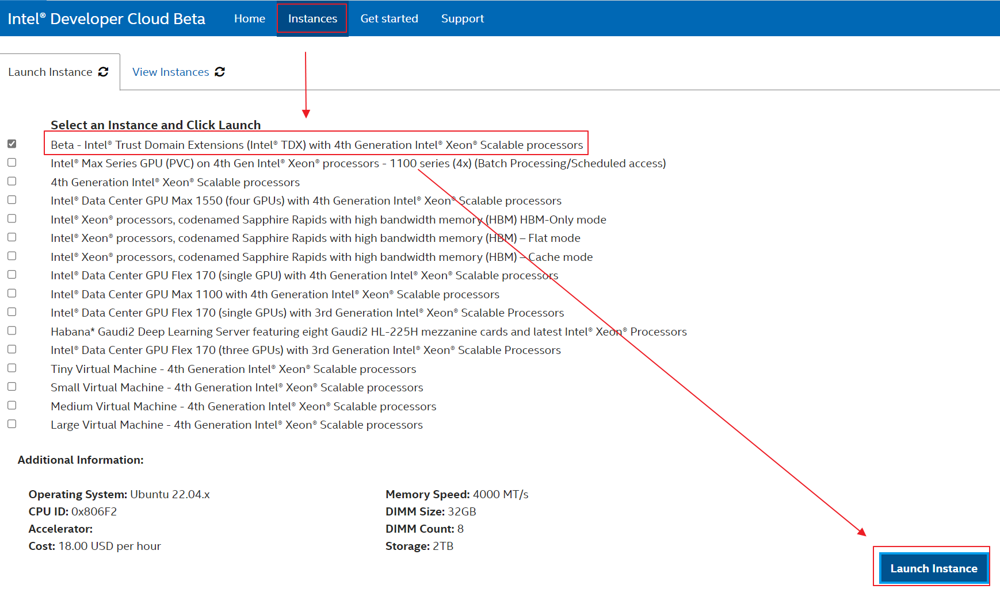
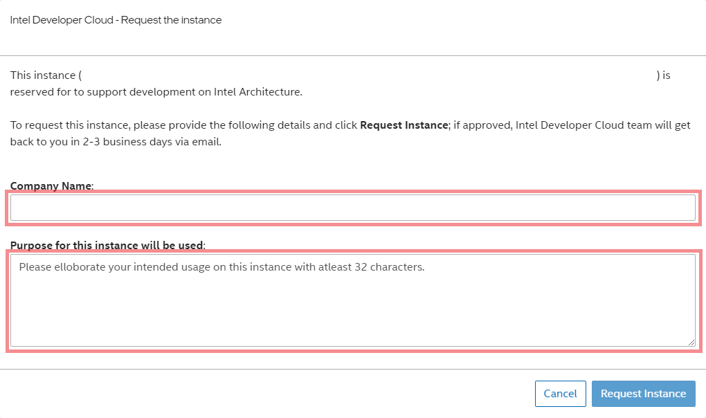
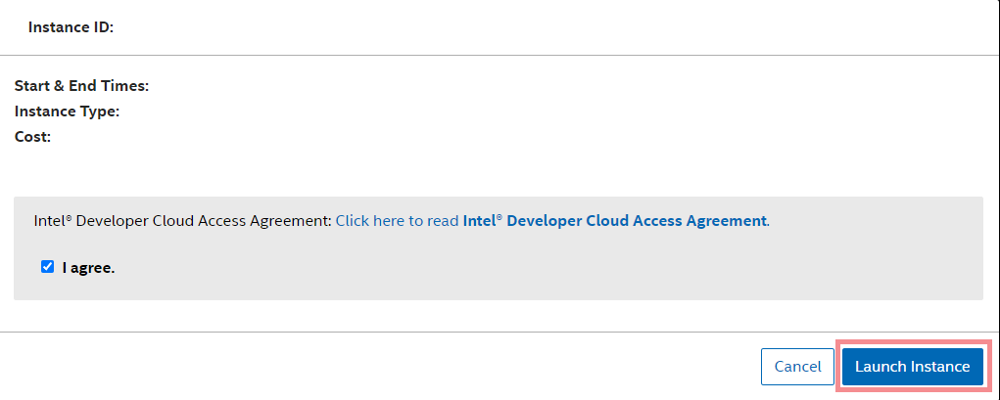
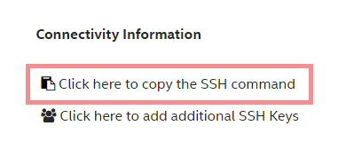

# Intel Developer Cloud (IDC) TDX Amber Preview

## 1. Customer On-Board DevCloud

### 1.1 Registration

1. Signup with your corporate email address at [Intel® Developer Zone](https://www.intel.com/content/www/us/en/forms/developer/standard-registration.html?tgt=https://www.intel.com/content/www/us/en/secure/developer/devcloud/cloud-launchpad.html), if not already done.
2. Signin at [Intel® Developer Zone](https://www.intel.com/content/www/us/en/my-intel/developer-sign-in.html?redirect=https://scheduler.cloud.intel.com).
3. Launch and access instance from [Intel® Developer Cloud Management Console](https://scheduler.cloud.intel.com/).

### 1.2 Setup - SSH Keys

Setting up SSH Keys is an one time task.

**WARNING**: Never share your private keys with anyone. Never create a SSH Private key without a passphrase.

1. Launch a Terminal/Command Prompt on your local system.
2. Copy & Paste the following to your terminal/command prompt to generate SSH Keys.

   - Linux*/macOS*:
   ```
   ssh-keygen -t ed25519 -f ~/.ssh/id_rsa
   ```
   - Windows*:
   ```
   mkdir %USERPROFILE%\.ssh
   ssh-keygen -t ed25519 -f %USERPROFILE%\.ssh\id_rsa
   ```

3. If you are prompted to overwrite, select no.
4. Copy & Paste the following to your terminal/command prompt to open your public key.

   - Linux*/macOS*:
   ```
   vi ~/.ssh/id_rsa.pub
   ```
   - Windows*:
   ```
   notepad %USERPROFILE%\.ssh\id_rsa.pub
   ```

    _Note: The public key must be in your profile before starting an instance. The instance will need to be relaunched if the public key was updated after a virtual machine is launched._

5. Copy the entire content of the file id_rsa.pub
6. Click Profile Icon from the top blue navigation bar and click Profile. You must login to [Intel® Developer Cloud Management Console](https://scheduler.cloud.intel.com/) to see Profile Icon.


7. Paste the copied content in the text box **SSH RSA 4096 Public Key** and Click **Save Key**

    **Note**: If your key is not in default path/name, you must add IdentityFile parameter in SSH config file.

    **WARNING**: If you are connecting to Intel Developer Cloud from your company Corporate Network, you will need to follow the section [Access from Corporate Network](#13-access-from-corporate-network).

### 1.3 Access from Corporate Network
**WARNING**: If you are connecting to Intel Developer Cloud from your company Corporate Network, you will need to update SSH config file.

**Note**: If you connect using Command Prompt on Microsoft* Windows* Operating System, you must install [gitforwindows](https://gitforwindows.org/).

1. Setting up SSH Configuration is an one time task.
2. Your SSH configuration file is located in a folder named .ssh under your user's home folder. If the file is not present, create one.
3. Copy & Paste the following to SSH config file (~/.ssh/config).

   - Linux*/macOS*:
   ```
   Host 146.152.*.* idcbetabatch.eglb.intel.com
   ProxyCommand /usr/bin/nc -x PROXYSERVER:PROXYSPORT %h %p
   ```
   - Windows*:
   ```
   Host 146.152.*.* idcbetabatch.eglb.intel.com
   ProxyCommand "C:\Program Files\Git\mingw64\bin\connect.exe" -S PROXYSERVER:PROXYSPORT %h %p 
   ```

4. From your Lab Administrator, get PROXYSERVER and PROXYPORT in your Corporate Network for SSH, NOT for HTTP/HTTPS Proxy.

5. Replace PROXYSERVER and PROXYPORT with the information you received from your lab administrator and save the SSH Config file.

### 1.4 Request Access to TDX Bare Metal Instance

1. All Bare Metal Instances are available upon request only. Follow the instructions below to request a Bare Metal Instance.
2. Click Instances from top blue navigation bar
3. Click on check box of chosen instance "Beta - Intel® Trust Domain Extensions (Intel® TDX) with 4th Generation Intel® Xeon® Scalable processors"
4. Click Launch Instance

5. Review the details and Click 'Request Instance'

6. Enter your company name in full and provide purpose of this instance request in few lines.

7. If your request is approved, Intel Developer Cloud Customer Response Team will respond within 2-3 business days.

### 1.5 Launch a Bare Metal Instance
1. To launch a Bare Metal Instance, follow the instructions below.
2. Click Instances from top blue navigation bar
3. Click on check box of requried instance
4. Click Launch Instance
5. Read the Intel(R) Developer Cloud Access Agreement and Click check box agree, if you agree
6. Click Launch Instance

7. If user is allowed to launch this instance, instance will be launched and user will be redirected to View Instances.
8. Bare Metal Instance provisioning might take few minutes.
9. If you would like to terminate instance at any time, click the red colored icon in screen shot above.

**Note**: Only your current public key will be authorized to access this instance.
**Note**: If you have multiple keys to be authorized to access your reserved instances, or you have changed your public key in profile, you need add those keys in each reserved instance separately.

### 1.6 Access a Bare Metal Instance

1. WARNING: All Bare Metal Instances get auto terminated after 7 days from launch time.
2. To access a launched Bare Metal Instance, from 'View Instances', Click on 'Click here to copy the SSH command' and paste in your terminal or command prompt.



**Note**: If the SSH command errored out for the option '-J', your ssh client version might be too old. Modify the SSH Command as per the format below and run.

```
ssh -o ProxyCommand="ssh -W %h:%p guest@JUMP_HOST_IP " USERNAME@TARGET_IP
```

3. Because you have copy pasted the command from Intel Developer Cloud portal, type 'yes' to continue, if prompted.
4. User will be shown a password and prompted to enter the password. Enter the shown password.
5. After entering the password, user will be logged into the launched Bare Metal Instance.
6. To upload a file to launched instance, open a new terminal on your local system.
7. Type scp -P 10022 [FILE_NAME] devcloud@localhost:[PATH_TO_DESTINATION]
8. To download a file from launched instance, open a new terminal on your local system.
9. Type scp -P 10022 devcloud@localhost:[PATH_TO_DESTINATION] .
10. If you have multiple keys to be authorized to access your reserved instances, you can add those additional keys by following the next step without relaunching instance.
11. In View Instances, on a launched instance, Click on Click here to add additional SSH Keys, to add your additional SSH keys.


12. If you have changed your public key in profile after you launched an instance, you can add your new key by following the next step without relaunching instance.
13. In View Instances, on a launched instance, Click on Click here to add additional SSH Keys, to add your additional SSH keys.


### 1.7 Help/Support Resources


## 2 Intel Project Amber info
You will also receive another email with subject "Intel® Trust Domain Extensions and Project Amber in Intel® DevCloud". The email will contain the Amber API key and Amber URL that you will need for attestation.

## 3 Use TDX VM
### 3.1 Initial setup

Once logged into the TDX-enabled system, clone the GitHub project and execute the initialization scripts.

```
git clone https://github.com/IntelConfidentialComputing/tdx-amber-idc-preview
cd tdx-amber-idc-preview/scripts
./init.sh
```


### 3.2 Create TDVM


- Create a TD guest image from official Ubuntu 22.04 image as follows:
```
./create-guest-image.sh -o <image file name> -u <username> -p <password> -n <guest vm name>
```
Example
```
./create-guest-image.sh -o tdx-guest.qcow2 -u tdx -p 123TdVMTest -n my-guest
```

- Start TDVM via libvirt
After creating the guest image, use the following command to create a TDVM
```
/start-virt.sh -i <image file name> -n <guest vm name>
```
Example
```
./start-virt.sh -i tdx-guest.qcow2 -n my-guest
```

- You can manage the TDVM using vrish toll with the commands below (optional)
```
# Examples of commands to manage VMs (should be run on the host)
#To escape out of TVDM use ^] (i.e. hit Ctrl+] keys)

# list all VMs created by current Linux account
virsh list --all

# Suspend a VM
virsh suspend my-guest

# Resume a VM
virsh resume my-guest

# Shutdown a VM
virsh shutdown my-guest

# To start a VM
virsh start my-guest

# To connect to the VM Console
virsh console my-guest
```
_NOTE: To exit a running VM please use ^] (Ctrl + ])
_NOTE: please change `my-guest` to your guest's name._

_NOTE: Please check chapter 3.2 at the [Whitepaper: Linux* Stacks for Intel® Trust Domain Extension 1.0 v0.10](https://www.intel.com/content/www/us/en/content-details/783067/whitepaper-linux-stacks-for-intel-trust-domain-extension-1-0.html)_

### 3.3 Check Trusted Execution Environment (TEE) environment

1. Check TD Report

`TDREPORT` is a fixed-size data structure generated by the TDX module which contains guest-specific information (such as build and boot measurements), platform security version, and the MAC to protect the integrity of the `TDREPORT`. For more details on `TDREPORT` please refer to section 4.2 in the [Whitepaper: Linux* Stacks for Intel® Trust Domain Extension 1.0 v0.10](https://www.intel.com/content/www/us/en/content-details/783067/whitepaper-linux-stacks-for-intel-trust-domain-extension-1-0.html)_

```
to generate the td report run the following command
tdx@tdx-guest:~$ tdx_tdreport
```

### 3.4 Use Amber client to generate quote

```
tdx@tdx-guest:~$ sudo amber-cli quote

```

### 3.5 Attestation
Execute the following commands to perform the attestation.
```
tdx@tdx-guest:~$ export AMBER_URL=<AMBER URL String>
tdx@tdx-guest:~$ export AMBER_API_KEY=<AMBER API Key>
tdx@tdx-guest:~$ amber-cli create-key-pair -k key.pem
tdx@tdx-guest:~$ sudo -E amber-cli token
```
_Note: Make cure there are no white space before or after the API key_

## 4. Run workload without attestation in TDVM
Running workloads in a TDVM is exactly the same as you would run the workload in a non-confidential VM.
For example, run the nginx web server in a container
```
tdx@tdx-guest:~$sudo docker run -it --rm -d -p 8080:80 --name web nginx
tdx@tdx-guest:~$curl http://localhost:8080
```

## 5. Further Reading

- [Intel TDX Whitepaper](https://www.intel.com/content/www/us/en/developer/articles/technical/intel-trust-domain-extensions.html)
- [Amber Introduction](https://projectamber.intel.com/)
- [Whitepaper: Linux* Stacks for Intel® Trust Domain Extension 1.0](https://www.intel.com/content/www/us/en/content-details/783067/whitepaper-linux-stacks-for-intel-trust-domain-extension-1-0.html) or [here](/doc/White%20Paper%20-%20Linux%20Stack%20for%20Intel®%20TDX-v0.10.pdf)
- [Confidential Cloud Native Primitives (CCNP)](https://github.com/intel/confidential-cloud-native-primitives)
